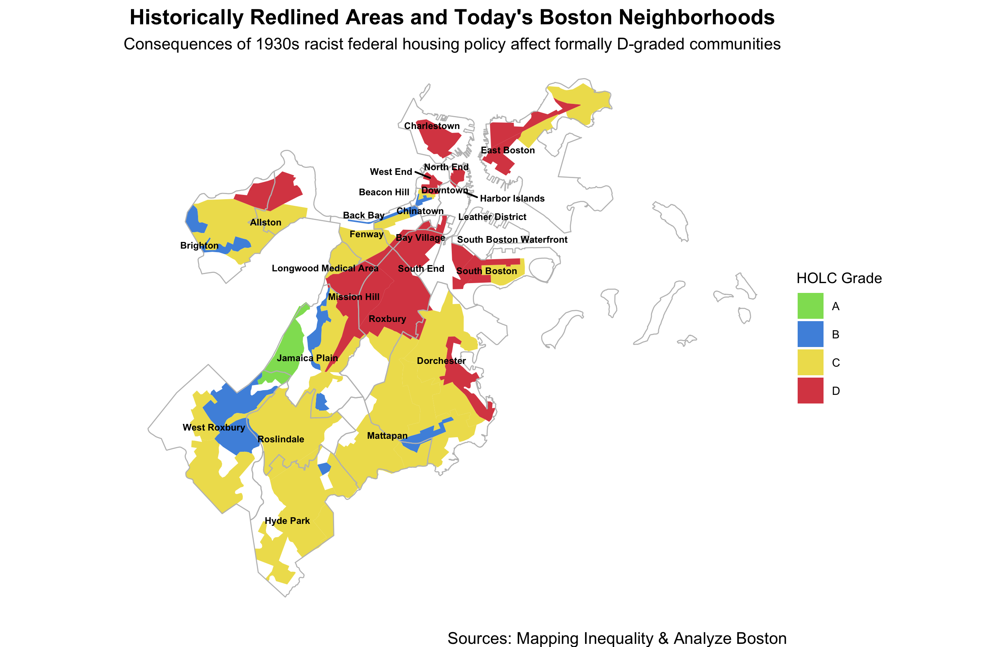
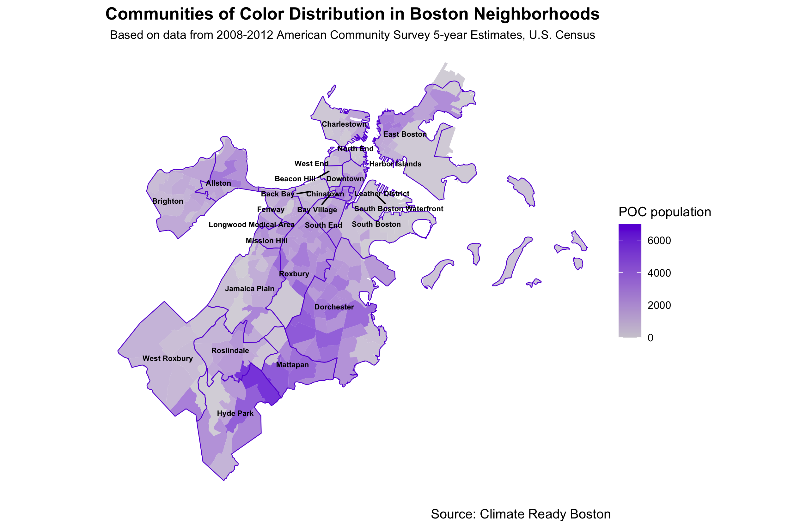

In a city as diverse as Boston, different communities may be less prepared for the extreme effects of climate change. Factors such as older or younger age, pre-existing medical conditions and low-income can place a person at greater risk to extreme heat.

With the [urban heat island effect](https://www.nytimes.com/interactive/2019/08/09/climate/city-heat-islands.html), urban areas, lacking in greenery, are more susceptible to extreme heat than rural ones. Extreme heat can accumulate on heat-absorbent surface areas, such as buildings and pavement. But within Boston itself, neighborhoods vary by the amount of open space and trees, which contributes to varying extents of urban heat in different communities on the same hot summer day, as seen in Metropolitan Area Planning Council's [map](https://web.tplgis.org/bostonmetromayorsecure/pdfmaps/ClimateSmart_MetroBoston_Cool_Combined_34x44_20171113.pdf) for the Boston metropolitan area. .

This year, Boston had its hottest summer [on record](https://boston.cbslocal.com/2020/09/09/massachusetts-hottest-summer-temperature-noaa-climate-report/). As the Earth's climate continues to warm, identifying which neighborhoods are more at risk to extreme heat is crucial for climate preparedness.

This data project, told in three parts and developed with R, will help provide visualizations of the disproportionate effect of a warmer Boston for specific communities and examine how historical redlining may have had a lasting effect on those communities today.




A preview of visualizations to come

## Setup
```{r setup, echo=TRUE, results='hide'}
# Load required libraries
library(tidyverse)
library(plotly)
library(htmlwidgets)
library(forcats)
```


## Loading data
```{r load datasets, echo=FALSE}
# Load datasets
# Source: Climate Ready Boston: https://data.boston.gov/dataset/climate-ready-boston-social-vulnerability
climate_ready <- read_csv("data/climate_ready.csv")
view(climate_ready)

```

## Preparing Data

```{r dplyr analysis}
# use dplyr to rename and select certain columns
climate_ready_sel <- climate_ready %>% select(FID, GEOID10, tract_population = POP100_RE, tract_housing = HU100_RE, neighborhood = Name, low_income = Low_to_No, LEP, older = OlderAdult, POC = POC2, med_illness = MedIllnes, children = TotChild) %>% 
  glimpse()

# sum different population data columns based on neighborhood
climate_ready_analysis <- climate_ready_sel %>% group_by(neighborhood) %>% 
  summarize(neighborhood_population = sum(tract_population), POC = sum(POC), LEP =sum(LEP),
            older = sum(older), med_illness = sum(med_illness), low_income = sum(low_income), children = sum(children)) %>% glimpse()
view(climate_ready_analysis)

#write.csv(climate_ready_analysis, "data/climate_ready_analysis.csv")

```

## Checking Boston neighborhoods
```{r checking neighborhoods}
# Checking neighborhood names in Boston Neighborhoods dataset

# Load CSV for Boston Neighborhoods
boston_neighborhoods <- read_csv("data/Boston_Neighborhoods.csv")
boston_neighborhoods %>% glimpse() # count: 26
summary_neighborhoods <- boston_neighborhoods %>% select(Name) %>% 
  arrange(Name) %>% glimpse()


# Noting differences between neighborhood names
view(summary_neighborhoods) 
# Additional neighborhoods: Beacon Hill, Chinatown and Downtown
# Longwood

view(climate_ready_analysis$neighborhood) # count: 23
# Longwood Medical Area

# download csv of neighborhood names
# write.csv(summary_neighborhoods, "data/neighborhoods.csv")
```

## Part 1: A Heat Map of Population Distribution of Vulnerable Communities
In order to examine different populations in Boston neighborhoods, I used a 2016 dataset of vulnerable social groups from [Climate Ready Boston](https://www.boston.gov/departments/environment/preparing-climate-change), the city's initiative for preparing for the long-term effects of climate change. [This dataset](https://data.boston.gov/dataset/climate-ready-boston-social-vulnerability) was obtained from Analyze Boston.

The original dataset, derived from research by certified emergency manager  [Atyia Martin](http://www.atyiamartin.com/contact), has population data organized by U.S. Census tract for older adults, children, people with limited English proficiency (LEP), low-income, people of color and individuals with medical illnesses, such as asthma, heart disease, emphysema, bronchitis, cancer, diabetes, kidney disease and liver disease. It also includes the neighborhood name and total populations for each Census tract.

**Some things to note when interpreting this data:** 
* The population data is based on 5-year estimates from the U.S. Census American Community Survey from 2008-2012, which may be somewhat outdated and not directly reflect population data this year. 
* Many of these same individuals who are part of one group may be counted toward another or more groups, but the data does not identify population of people in multiple groups.

### Making a heat map

In order to simplify the data for visualizing, I used *dplyr*. I found the totals for each group across neighborhood names. Note that the original dataset only has **23 neighborhoods** and does not include Beacon Hill, Chinatown or Downtown. Knowing I wanted to create a heat map, I converted the data into long-form format using the *tidy* function in the *tidyr* package. 

Then, using *ggplot2*, I created this heat map to visualize the percent makeup of each population group compared to the total neighborhood population. This allows for some standardized comparison across different neighborhoods and you can identify which communities may be in need of greater climate preparedness, depending on the frequency of deeper tiles.  

The following interactive heat map was created with the *plotly* package and its *ggplotly* function. Hover over the tiles and a tooltip will pop up. 


```{r heat map, echo=TRUE}

# Reformat the data from wide to long dataframe format using "tidyr" package (included in tidyverse). See "Reshape Data": https://github.com/rstudio/cheatsheets/blob/master/data-import.pdf.
# Add a percentage column
climate_ready_percents <- gather(climate_ready_analysis, "POC", "low_income", "LEP", "older", "children", "med_illness", key ="population_type", value= "population") %>% 
  mutate(population = round(population, digits = 0)) %>% 
  mutate(percentage = round((population/neighborhood_population), digits=2)) %>%
  glimpse()

# Heat Map, reference: https://www.r-graph-gallery.com/79-levelplot-with-ggplot2.html
# Add new column for plotly tooltip "text" in heatmap later
climate_ready_percents <- climate_ready_percents %>% 
  mutate(description = paste0("neighborhood: ", neighborhood, "\n","proportion: ", percentage, "\n", "population: ", population, "\n", "neighborhood population: ", neighborhood_population)) 

# Create heat map
# RColorBrewer color palettes: https://www.r-graph-gallery.com/38-rcolorbrewers-palettes.html
heatmap.climate_ready <- ggplot(climate_ready_percents, mapping = aes(x = population_type, y=neighborhood, fill = percentage, text = description)) +
  geom_tile(width=1, color = "gray") +
  scale_fill_distiller(palette= "YlOrRd", direction= +1) +
  labs(titles = "Boston Communities Vulnerable to Climate Change", subtitle = "Based on data from 2008-2012 American Community Survey 5-year Estimates, U.S. Census", x = "population", y = "neighborhood", fill = "proportion", caption = "Source: Climate Ready Boston") +
  theme_classic() +
  theme(axis.text.x = element_text(size = 8),
        axis.text.y = element_text(size = 8),
        plot.title = element_text(size=12, face = "bold", hjust = 0.5),
        plot.caption= element_text(size=7),
        plot.subtitle = element_text(size=9, hjust =0.5),
        legend.text = element_text(size = 6),
        panel.grid.major = element_line(size = 0.2, color = "gray"))
heatmap.climate_ready
#ggsave("heatmap.png", width=7, height = 5, unit="in")

## Make heatmap interactive using ggplotly
iheatmap.climate_ready <- heatmap.climate_ready %>% ggplotly(tooltip="description")
iheatmap.climate_ready

## Save html widget using library(htmlwidgets)
#saveWidget(iheatmap.climate_ready, "img/ggplotlyHeatmap.html")

```

## Part 2: Neighborhood Comparisons of People of Color and Low-income Populations

While examining percentages of population is useful, it is equally important to identify which communities have the most vulnerable people by overall population. I chose the groups - people of color and low-income populations - to analyze more closely.

### Making a Grouped Bar Chart

Using *dplyr* again, I filtered the same long-form dataset, derived from the Climate Ready Boston dataset, to only these two groups and reordered the neighborhoods by population values and then created a grouped bar chart using *ggplot2*.

The following grouped bar chart shows that Roxbury and Dorchester have the most people of color and low-income populations of the Boston neighborhoods. Note that these neighborhoods are also among the largest Boston neighborhoods.


```{r grouped bar chart}
# Reorder values displayed in graph using forcats library, see reference: https://www.r-graph-gallery.com/267-reorder-a-variable-in-ggplot2.html
# Grouped bar chart for low income and POC only - but by population
plot.POC_lowincome <- climate_ready_percents %>%
  filter(population_type %in% c("POC", "low_income")) %>%
  mutate(neighborhood = fct_reorder(neighborhood, population)) %>% ggplot(mapping = aes(x= population, y=neighborhood, fill= population_type)) +
  geom_bar(position = "dodge", stat = "identity", width =.75, alpha = 0.8) +
  scale_fill_manual(values = c("#ff8100", "#6821d8")) +
  labs(title = "Populations of Low-income and People of Color in Boston", x="population", y="neighborhood", fill = "population type", subtitle="Based on data from 2008-2012 American Community Survey 5-year Estimates, U.S. Census",
       caption = "Source: Climate Ready Boston") +
  theme_dark() +
  theme(axis.title = element_text(size=9), 
        axis.text = element_text(size = 7, color = "black"),
        axis.line = element_line(size = 1, color ="#747272"),
        axis.ticks.length.y = unit(.15, "cm"),
        axis.ticks.length.x = unit(.15, "cm"),
        plot.title = element_text(size=12, face="bold", hjust=0.5),
        plot.caption = element_text(size=7),
        plot.caption.position = "plot",
        plot.subtitle = element_text(size=9),
        legend.title = element_text(size = 9),
        legend.text = element_text(size = 7))
plot.POC_lowincome

#ggsave("img/POC_lowincome_barchart.png", width=8, height = 5, unit="in")

```


## Part 3: How the Racist Past Affects Boston Today
### Examining Racist Historical Housing Policy, Open Space and Low-income Populations

Researchers suggest that in the United States, people of color tend to be at greater risk to extreme heat and other public health emergencies, including the current COVID-19 pandemic. This is likely due to more people of color having susceptible health conditions and/or living in low-income houses. 

However, researchers believe that historical redlining, a racist housing policy conducted in the 1930s by the federal agency Home Owners' Loan Corporation, has lasting underlying effects, partly responsible for this racial disproportion, as reported by [The New York Times](https://www.nytimes.com/interactive/2020/08/24/climate/racism-redlining-cities-global-warming.html). HOLC appraisers graded different areas from A (green), B (blue), C (yellow) and D (red) and in turn determined who would be allowed to receive federal and bank housing loans. The D-grade, a redlined area, would be the lowest grade and often assigned to neighborhoods with a majority of Black residents and other people of color.

### Making choropleths

To visualize the effects of this for Boston, I created several choropleths using the *ggplot2* function *geom_polygon*. I primarily worked with geoJSON files for this part of the project. To read each geoJSON in R, I used the *geojsonio* library and converted each dataset (fortified) using the *broom* package.

#### Historically redlined areas and present day Boston neighborhood borders

This map shows historically redlined areas and layers modern Boston neighborhood borders.

I obtained a geoJSON of 1938 HOLC map of Boston from [Mapping Inequality](https://dsl.richmond.edu/panorama/redlining/#loc=5/39.1/-94.58&text=downloads), a project that has digitized historical redlining maps for major U.S. cities. 

* Citation: Robert K. Nelson, LaDale Winling, Richard Marciano, Nathan Connolly, et al., “Mapping Inequality,” American Panorama, ed. Robert K. Nelson and Edward L. Ayers, accessed October 25, 2020, https://dsl.richmond.edu/panorama/redlining/#loc=5/39.1/-94.58&text=downloads.

I also used a [geoJSON dataset of Boston neighborhoods](https://data.boston.gov/dataset/boston-neighborhoods), obtained from Analyze Boston, in order to have neighborhood borders on the map. This dataset includes 26 neighborhoods and does include Beacon Hill, Chinatown or Downtown, as opposed to the earlier Climate Ready Boston dataset. 

After plotting the redlined areas and layering the neighborhood borders, I found it quite difficult to label the neighborhoods with their respective names. As a workaround, I isolated a list of 26 neighborhoods and created a new dataset with the center of each neighborhood by longitude and latitude coordinates obtained from Google Search. This dataset is available in [this Google Sheet](https://docs.google.com/spreadsheets/d/1H6UiNGURnFsb4_LFyPlDZRnnTZhZtQanrozmVdv7rbw/edit?usp=sharing). I then used *geom_text_repel* from the *ggrepel* package to plot these coordinates and neighborhood names as labels. 


```{r setup2, echo=TRUE, results='hide'}
library(geojsonio)
library(broom)
library(ggrepel)
library(mapproj)
```


``` {r loading datasets for part 3, echo=FALSE, results='hide'}
# Load additional datasets - geoJSON files

## When working with .geoJSON files, I will be following this tutorial: https://www.r-graph-gallery.com/325-background-map-from-geojson-format-in-r.html

boston_borders <- geojson_read("data/Boston_Neighborhoods.geojson", what="sp")
#view(boston_borders)

boston_redlining <- geojson_read("data/MABoston1938.geojson", what = "sp")
#view(boston_redlining)

climate_ready_geo <- geojson_read("data/climate_ready.geojson", what= "sp")
#view(climate_ready_geo)

open_space_geo <- geojson_read("data/Open_Space.geojson", what= "sp")
#view(open_space_geo)


## 'fortify' geoJSON files - converts geospatial file to dataframe format
boston_borders_fort <- tidy(boston_borders, region = "Name")
#view(boston_borders_fort)

boston_redlining_fort <- tidy(boston_redlining, region = "holc_id")
#view(boston_redlining_fort)

climate_ready_geo_fort <- tidy(climate_ready_geo, region = "GEOID10")
#view(climate_ready_geo_fort)

open_space_fort <- tidy(open_space_geo, region = "SITE_NAME")
#view(open_space_fort)

# Load csv for neighborhood coordinates (obtained manually via Google search)
data_coordinates <- read_csv("data/neighborhoods_coordinates.csv")

```


# Part 3 - R analysis
```{r choropleth 1/4, echo = TRUE}
# Choropleth in ggplot, reference: https://www.r-graph-gallery.com/327-chloropleth-map-from-geojson-with-ggplot2.html

# Choropleth 1: Historically redlined areas and present day Boston neighborhood borders
# Add new id2 column to boston_redlining_fort for simplified neighborhood grade (eg. A1 -> A) 
# Extract only first letter of id using base R substr function
# Source: Joachim Schork of Statistics Globe https://statisticsglobe.com/r-extract-first-or-last-n-characters-from-string
boston_redlining_fort <- boston_redlining_fort %>% 
  mutate(id2 = substr(id, 1, 1)) %>% glimpse()
#view(boston_redlining_fort)

## coordinates: rename "Name" column to "neighborhood"
coordinates <- data_coordinates %>% select(neighborhood = "Name", long, lat)
#view(coordinates) 
# This dataset has 26 neighborhoods, derived from Boston Neighborhoods csv

# Make Choropleth 1
# label regions using geom_text and boston_coord
# Use coord_map() for map-like rendering https://ggplot2.tidyverse.org/reference/coord_map.html
# Use geom_text_repel so neighborhood labels don't overlap on map. See: https://cran.r-project.org/web/packages/ggrepel/vignettes/ggrepel.html
plot.redlining <- ggplot() +
  geom_polygon(data = boston_redlining_fort, aes(x = long, y = lat, group = group, fill = id2), alpha = 0.8) +
  geom_polygon(data = boston_borders_fort, aes(x= long, y = lat, group = group), fill = NA, color = "gray", alpha = 0.8, size = 0.3) +
  geom_text_repel(data = coordinates, aes(label = neighborhood, x = long, y=lat), color = "black", size = 2, fontface = "bold", point.padding=NA) +
  scale_fill_manual(values = c("#6fd62f", "#0975d8", "#ead723", "#d01313")) +
  labs(title = "Historically Redlined Areas and Today's Boston Neighborhoods", subtitle = "Consequences of 1930s racist federal housing policy affect formally D-graded communities", fill = "HOLC Grade", caption = "Sources: Mapping Inequality & Analyze Boston") +
  theme_void() +
  theme(plot.background = element_rect(fill=NA, color = NA),
        panel.background = element_rect(fill = NA, color = NA),
        plot.title = element_text(size=13, face = "bold", hjust=0.5),
        plot.caption= element_text(size=10),
        plot.subtitle = element_text(size=10, hjust=0.5),
        legend.text = element_text(size = 7),
        legend.title = element_text(size =9)) +
  coord_map()
plot.redlining

#ggsave("img/redlining_map.png", width=8.5, height= 5.5, units="in")

```


#### Choropleth 2 & 3: Distribution of POC and low-income populations, gradient for U.S. Census tracts, outline of neighborhood borders

Here is a comparison of the distribution of people of color and low-income populations in Boston.

These maps can be compared to the redlining map. For historically redlined areas and even yellowlined areas, these neighborhoods include more people of color and low-income.

``` {r choropleth 2/4, echo = TRUE}
# Choropleth 2: Distribution of POC populations, gradient for U.S. Census tracts, outline of neighborhood borders

#view(climate_ready_sel)
#view(climate_ready_geo_fort)
# Data based on different U.S. Census Tracts
data.climate_ready <- climate_ready_sel %>% 
  select(GEOID10, low_income, POC, tract_population, neighborhood) %>%
  glimpse()

class(data.climate_ready$GEOID10)
class(climate_ready_geo_fort$id)

# convert GEOID10 column to character
data.climate_ready$GEOID10 <- as.character(data.climate_ready$GEOID10)
class(data.climate_ready$GEOID10)

# Merge climate_ready datasets (fortified geoJSON: id and csv:GEOID10)
climate_ready_merged <- left_join(climate_ready_geo_fort, data.climate_ready, by=c("id"="GEOID10"))
#view(climate_ready_merged)

# choropleth of POC communities
plot.POC <- ggplot() +
  geom_polygon(data = climate_ready_merged, aes(fill = POC, x = long, y = lat, group=group), alpha = 0.8) +
  geom_polygon(data = boston_borders_fort, aes(x= long, y = lat, group = group),fill=NA, color = "#6821d8", alpha = 0.5, size = 0.3) +
  geom_text_repel(data = coordinates, aes(label = neighborhood, x = long, y=lat), color = "black", fontface = "bold", size = 2, point.padding = NA) +
  scale_fill_gradient(low = "#cfcbd4", high = "#6821d8") +
  labs(title = "Communities of Color Distribution in Boston Neighborhoods", subtitle = "Based on data from 2008-2012 American Community Survey 5-year Estimates, U.S. Census", caption = "Source: Climate Ready Boston", fill = "POC population") +
  theme_void() +
  theme(plot.background = element_rect(fill=NA, color = NA),
        panel.background = element_rect(fill = NA, color = NA),
        plot.title = element_text(size=13, face = "bold", hjust=0.5),
        plot.caption= element_text(size=10),
        plot.subtitle = element_text(size=9, hjust=0.5),
        legend.text = element_text(size = 8),
        legend.title = element_text(size = 10)) +
  coord_map()
plot.POC

#ggsave("img/POC_map.png", width=8.5, height = 5.5, unit="in")

```


```{r choropleth 3/4, echo = TRUE}
# Choropleth 3: Distribution of low-income populations, gradient for U.S. Census tracts, outline of neighborhood borders
plot.lowIncome <- ggplot() +
  geom_polygon(data = climate_ready_merged, aes(fill = low_income, x = long, y = lat, group=group) ,alpha = 0.8) +
  geom_polygon(data = boston_borders_fort, aes(x= long, y = lat, group = group), fill = NA, color = "#f97100", alpha = 0.5, size = 0.3) +
  geom_text_repel(data = coordinates, aes(label = neighborhood, x = long, y=lat), color = "black", size = 2, fontface = "bold", point.padding = NA) +
  scale_fill_gradient(low = "#ead6c6", high = "#f97100") +
  labs(title = "Low-income Distribution in Boston Neighborhoods", subtitle = "Based on data from 2008-2012 American Community Survey 5-year Estimates, U.S. Census", caption = "Source: Climate Ready Boston", fill = "low-income population") +
  theme_void() +
  theme(plot.background = element_rect(fill=NA, color = NA),
        panel.background = element_rect(fill = NA, color = NA),
        plot.title = element_text(size=13, face="bold", hjust=0.5),
        plot.caption= element_text(size=10),
        plot.subtitle = element_text(size=10, hjust=0.5),
        legend.text = element_text(size = 7),
        legend.title = element_text(size = 9)) +
  coord_map()
plot.lowIncome

#ggsave("img/lowIncome_map.png", width=8.5, height=5.5, unit = "in")


```


#### Choropleth 4: Open space areas in Boston, neighborhood borders
One environmental factor to consider is the amount of open space within each neighborhood. Parks and trees within an urban setting are extremely valuable to provide cooling in surrounding areas. People who may not have air-conditioning or other home-cooling options can go outside to these open areas to escape the burden of extreme heat, in event of a heatwave. Yet some communities may have less open space than others.

I obtained a dataset on [open space areas](https://data.boston.gov/dataset/open-space) of conservation and reservation in Boston, from Analyze Boston. The map below, when compared to the previous maps, shows a correlation of less open spaces in areas that were historically redlined and have greater populations of color and of low-income today.
``` {r choropleth 4/4, echo = TRUE}
# Choropleth 4: Open space areas in Boston, neighborhood borders
plot.openspace <- ggplot() +
  geom_polygon(data = open_space_fort, aes(x= long, y = lat, group=group), fill = "forestgreen", alpha = 0.7) +
  geom_polygon(data = boston_borders_fort, aes(x = long, y = lat, group = group), fill = NA, color = "lightgray", alpha = 0.8, size = 0.5) +
  geom_text_repel(data = coordinates, aes(label = neighborhood, x = long, y=lat), color = "black", size = 2, fontface = "bold", point.padding = NA) +
  labs(title = "Open Space in Boston Neighborhoods", caption = "Source: Analyze Boston", subtitle = "Distribution of open green areas can affect urban heat in different neighborhoods") +
  theme_void() +
  theme(plot.background = element_rect(fill=NA, color = NA),
        panel.background = element_rect(fill = NA, color = NA),
        plot.title = element_text(size=13, face = "bold", hjust =0.5),
        plot.caption= element_text(size=10),
        plot.subtitle = element_text(size=10, hjust=0.5)) +
  coord_map()
plot.openspace

#ggsave("img/openSpace_map.png", width=7.5, height = 5, unit = "in")
```
